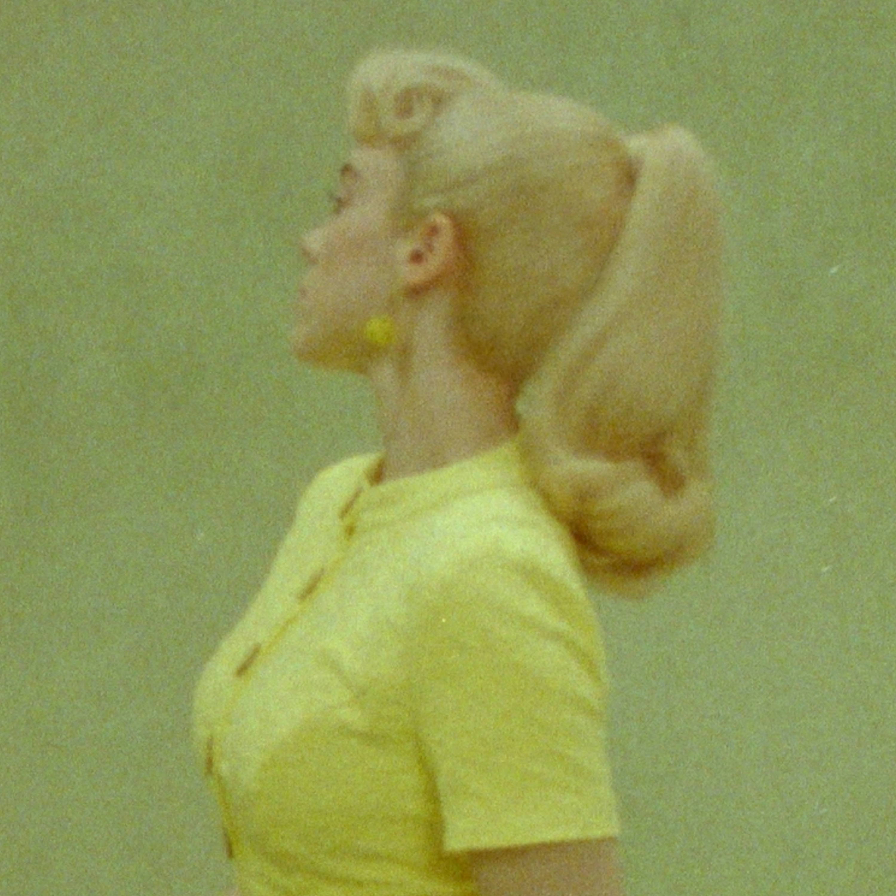
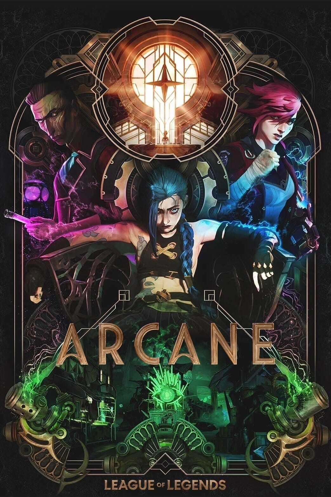
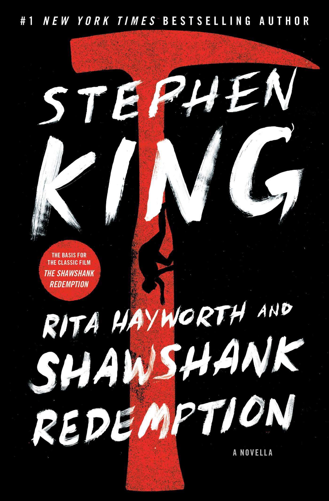
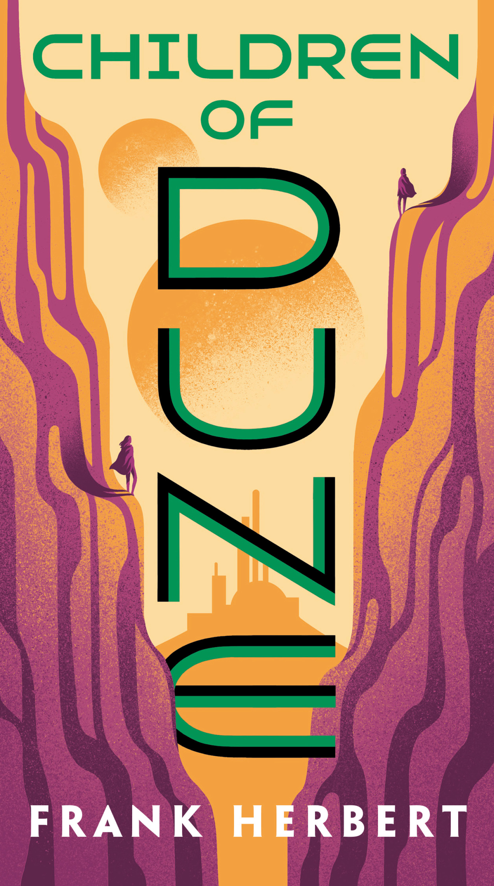
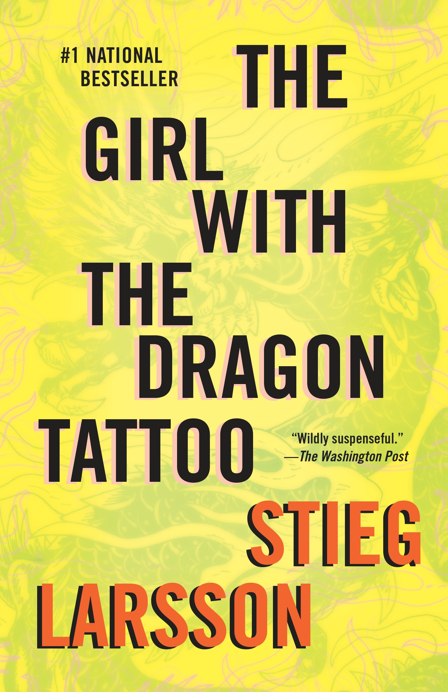

# 2024: The Media I Loved

2024 was a good year, with lots of really decent media being released. Below are the things I consumed that I believe are good enough to be shared. Note: not all of these were released in 2024. In fact, the majority of them were released in previous years. I’m just lazy and am now catching up.

## Music

### Hit Me Hard And Soft (album) - Billie Eilish (2024)

I don’t really know how to describe this album. All I know is that this is Billie Eilish’s best work to date. <cite>Wildflower</cite> is my favorite song, but all the songs on here show that Billie is growing as an artist and is actually taking advantage of her amazing voice. Finneas’ songwriting and production are also on full display here, making them the best musical duo in the world currently, in my opinion. I love almost every song on this album, with <cite>Lunch</cite> being the only one that I don’t particularly care for. It’s my favorite album this year and probably enters contention for my favorite album by any artist _ever_.

### What Was I Made For (song) - Billie Eilish (2023)

There really isn’t anything I can say about the main theme for <cite>Barbie (2023)</cite>. It’s already won a Grammy award for Song of the Year. I only watched <cite>Barbie</cite> this year (I know, I know). But this song stands out so much; it’s amazing how good it is. It’s enough to put tears in anyone’s eyes.

### The Greatest Show (song) - Multiple artists (2017)

An epic that fills you with the motivation to do anything you want. Who knew Wolverine could sing so well?

You can check out what I generally listen to here: <a href="https://www.last.fm/user/elvisnipah" target="_blank">Last.fm</a>

## Movies

### The Batman (2022)

Robert Pattinson sheds his sparkling diamond skin to emerge as an emo goth
cosplayer. This new (movie) take on Batman is very well done, with amazing
action, dialogue, setting, and music. Finally, we get to see the Bat as an
actual detective on screen, figuring out answers to The Riddler’s schemes. This
is, in my opinion, the best Batman movie we’ve seen (<cite>The Dark Knight</cite> is a
Joker movie, let’s be real).

### Blade Runner 2049 (2017)

You should probably see <cite>Blade Runner (1982)</cite> before this one, but this movie
stands on its own so well that you could choose not to, with Ryan Gosling
absolutely killing it in this role. It also happens to have
<a href="https://youtu.be/PBVB5MS9qYA" target="_blank">
  one of my favorite scenes in movie history.
</a>

Blade Runner 2049 questions our main character in an almost sadistic way,
finally revealing the truth to him in a way that evokes an immense amount of
sympathy. Fantastic movie, must-watch.

### Dune: Part Two (2024)

I’ll be honest here. I didn’t like <cite>Dune: Part One</cite> very much. As a recent
reader of the books, I felt it didn’t properly convey Frank Herbert’s writings
as well as I wanted. It was also a movie with a bunch of A-list stars in it, and
while they’re great actors, I believe some casting choices were made simply
because of their popularity rather than how well they fit the role. But <cite>Dune:
Part Two</cite> actually surprised me. I really, really liked this one. And no, it’s
not because there was more action in this one. The visuals are amazing, the
acting wonderful (I’m looking at you, Austin Butler), but the music production
by Hans Zimmer is just otherworldly. It really makes you feel like you’re on a
dystopian desert world inhabited by arguably the greatest monsters in fiction.

### The Greatest Showman (2017)

I don’t have much to say about this movie, to be honest. The acting is fine, the
music is good, the story is decent. But for some reason, this movie really
resonated with me. I suppose the simple message of achieving your dreams and
never giving up was presented in such a form that I couldn’t help but be
inspired by it. It’s hard to describe the emotions this film managed to make me
feel, so I just simply recommend you watch it if you haven’t already.

### Dead Poets Society (1989)

Finally, I understand that random <cite>Suits</cite> scene where Mike Ross says, “O
Captain. My Captain” to Harvey. Similar to <cite>The Greatest Showman</cite> this movie
inspires you to be who you want to be. Popularizing the Latin phrase “_carpe
diem_” meaning “_Seize the day_,” Dead Poets Society is a classic that everyone
should see. It’s funny, tragic, and most of all, liberating.

If you want to see what movies I’ve watched this year, take a look here: <a href="https://letterboxd.com/ftsenyo/films/diary/" target="_blank">Letterboxd diary</a>

## TV Shows

### Arcane (2021)

I tried watching the first season of <cite>Arcane</cite> when it came out in 2021 but abandoned it
midway through the first episode for some reason. With the new season released
this year, I decided to give it another go, and that was probably one of the
better decisions I made this year. <cite>Arcane</cite> is honestly the best animated show
I’ve ever seen. The animation is absolutely phenomenal, with a unique art style
that makes every single scene interesting to look at. The characters are
beautifully flawed, with Silco and Jinx’s relationship being my personal
highlight of the first season. The music is great –<cite>‘Enemy’</cite> by Imagine Dragons
is such a strong opening theme for this show. If you enjoy animation, you’ll
probably love <cite>Arcane</cite>. If you believe you’re too mature for anything that is
animated, I’m sorry that you’ve chosen to deny yourself an amazing world of
stories that are so beautifully captured in this medium.

### Succession (2018)

I wonder how HBO manages to consistently make such good shows, while other studios
like Netflix flounder and cancel actual good TV in favor of the drivel that sees
mass appeal (Yes, I’m dramatic and hyperbolic. Sue me). <cite>Succession</cite> is
definitely one of the best shows I’ve ever seen. It enters my personal top shows
alongside <cite>The Wire</cite> and <cite>Breaking Bad</cite>. The soundtrack by Nicholas Britell is
definitely worthy of other composers such as Ramin Djawadi and Hans Zimmer; so
much so that Spotify tells me my top 5 songs this year were all from the
<cite>Succession</cite> soundtrack. But the characters – gods, the characters. Each of our
main characters is written so well and yet so unlikeable you wonder why you’re
even rooting for some of them. <cite>Succession</cite> is the only show where I felt gloomy
when reaching the end, and by the finale, I was actually trying to convince
myself that there had to be more; the story couldn’t just end here. If you take
anything at all away from this post, it’s this: **Watch Succession**.

## Books

### Rita Hayworth and Shawshank Redemption - Stephen King (1982)

You may have seen the movie; you may not have. But this book is definitely worth
the read. It’s not long, the story is pretty simple, and the characters are few.
It portrays a man of great patience, unflappable in the face of disaster, with
the desire to accomplish the goal he’s set his mind to.

### Children of Dune - Frank Herbert (1976)

Ah, <cite>Dune</cite>. The classic that inspires many science fiction stories today and
continues on through Frank Herbert’s son. I really like <cite>Children of Dune</cite>. The
regular politicking of<cite>Dune</cite>is, in my opinion, at its best in this story. I
can’t really say much without spoiling the other <cite>Dune</cite>books, so go read the
first two books, <cite>Dune</cite> and <cite>Dune Messiah</cite>, and then read this one.

### The Girl With The Dragon Tattoo - Stieg Larsson (2005)

The only hardcopy book I read this year. It was by chance I decided to pick this
one up from the library in my house. Definitely not a book you’d want children
reading; it is a dark story about attempts to solve a murder that happened many
years in the past. There are graphic scenes of abuse and torture depicted, so if
that isn’t your cup of tea, then steer clear. I think Stieg Larsson has created
a decent story here, and I’m considering reading the other books in this series.

<a href="https://www.goodreads.com/user_challenges/53827330" target="_blank">
  Here are the books I've read this year.
</a>

## Bonus: YouTube

I watched _a lot_ of YouTube this year, and I find that a really good amount of good stuff is uploaded on there. So here are a few of my favourite videos from creators.

[Your Theme - CGP Grey](https://www.youtube.com/watch?v=NVGuFdX5guE)

[Why Rich People (sorta) Don't Wear Luxury - ALEXANDER](https://www.youtube.com/watch?v=g0UQgrFNExc)

[Russell's Paradox - a simple explanation of a profound problem - Jeffrey Kaplan](https://www.youtube.com/watch?v=ymGt7I4Yn3k)

[things I no longer believe in. - yan](https://www.youtube.com/embed/4CaSXEEqKBU?si=PuCk0Q94rVqSSnhT)
