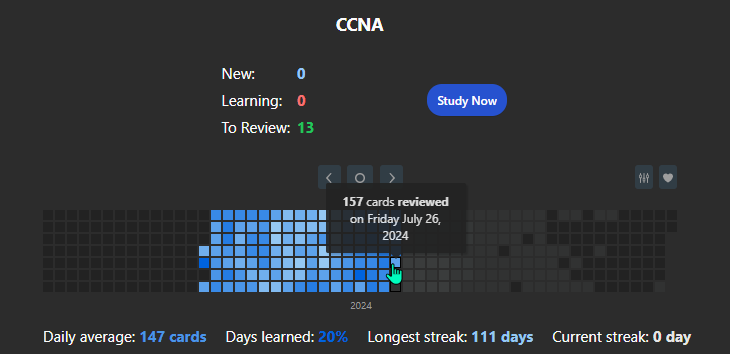

# CCNA

I [obtained my CCNA](https://www.credly.com/badges/e59a7783-5b71-481c-b230-da161524f21b/linked_in?t=shao2r) on the 26th of July, 2024.

## Section Analysis

| Section                    | Score |
| -------------------------- | ----- |
| Automation and Programming | 100%  |
| Network Access             | 70%   |
| IP Connectivity            | 84%   |
| IP Services                | 80%   |
| Security Fundamentals      | 93%   |
| Network Fundamentals       | 100%  |

## How

It took me almost 4 months to study for this exam. It is not an extremely challenging exam, but there is a large amount of information you need to know.

My main resource was the free [Jeremy's IT Lab YouTube Playlist](https://youtube.com/playlist?list=PLxbwE86jKRgMpuZuLBivzlM8s2Dk5lXBQ&si=2_pLVl4Ra64bigFx).

Practice tests were also from Jeremy's IT Lab: [Test 1](https://courses.jeremysitlab.com/p/ccna-practice-exam-1) and [Test 2](https://courses.jeremysitlab.com/p/ccna-practice-exam-2).

I've been using the flashcard application [Anki](https://apps.ankiweb.net) for a few years now, so Jeremy having premade decks made everything much simpler for me.

Keith Barker's [Online Quiz YouTube playlist](https://youtube.com/playlist?list=PLQQoSBmrXmrwZD-0fZVMieVRjI4k-fowj&si=Xc-0fVG9rQDMpRuv) was great as well.

The test cost $300 (GH₵4,650 at the time) to take.
